# Showtime!

# User applications

# Cricket 2004 Stroke Preview ( https://github.com/robeady/cricket-2004-stroke-preview )
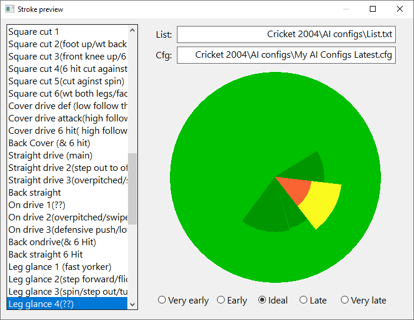

.

.

# Native-windows-gui Examples

# Basic
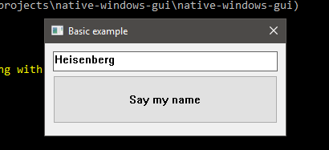

# WGPU canvas
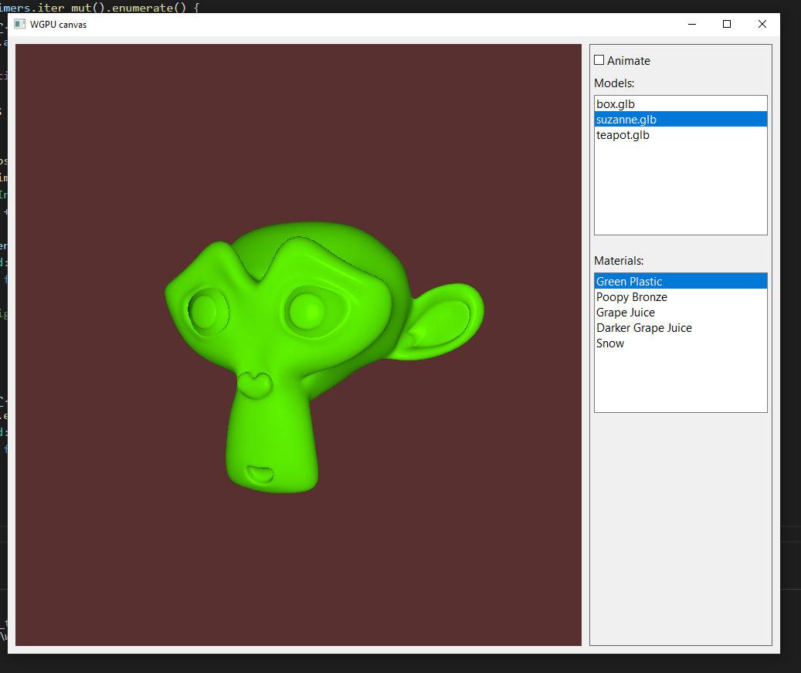

# Plotters canvas
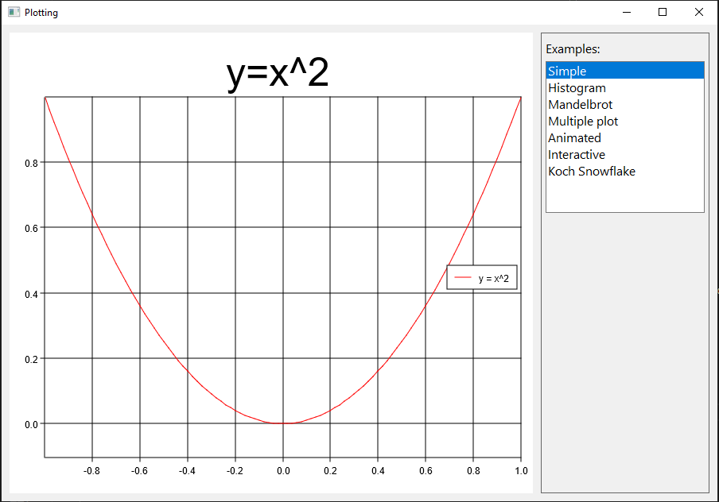
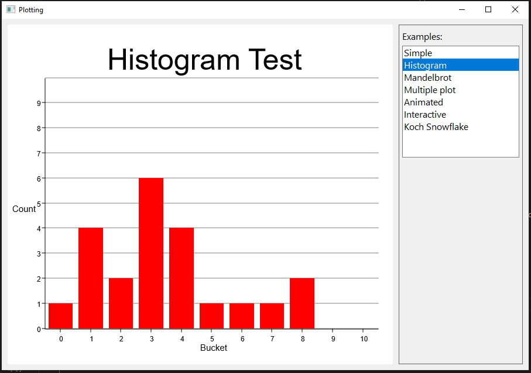
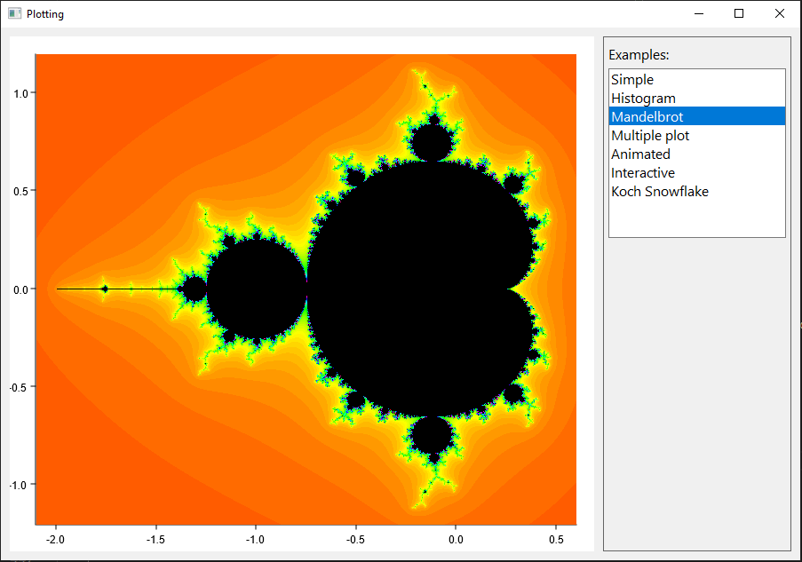
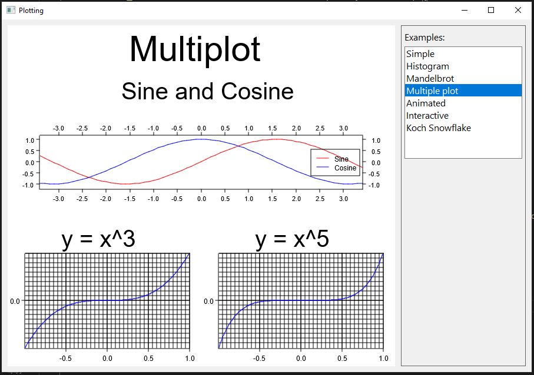

# Interactive tests
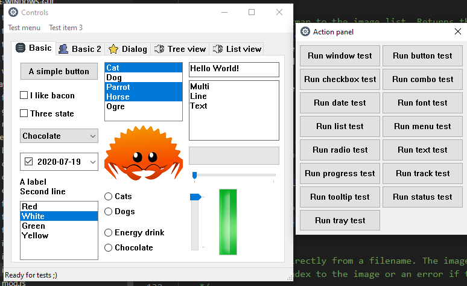
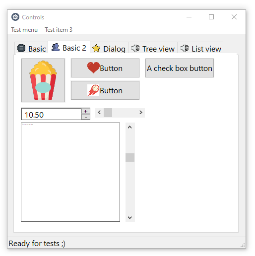
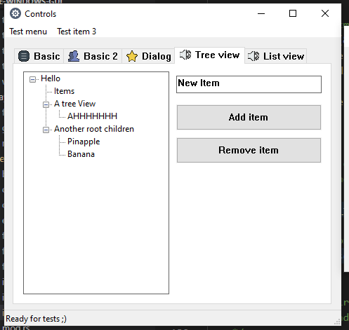
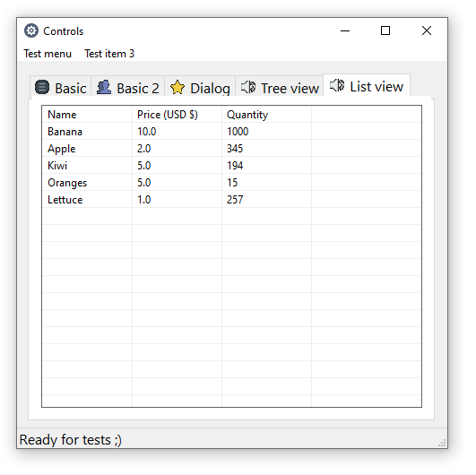

# Calculator
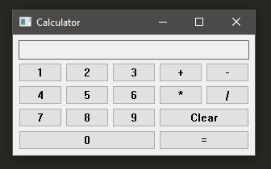

# Custom fonts

# Dialogs
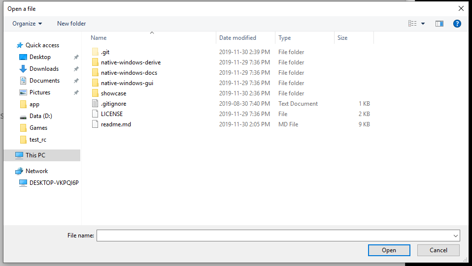
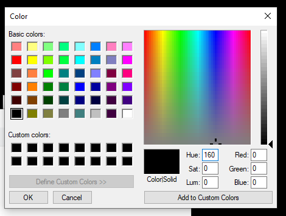
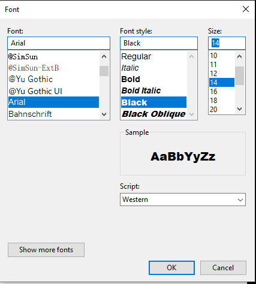

# Partials
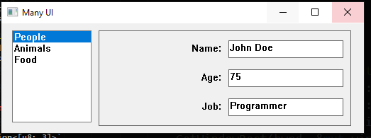
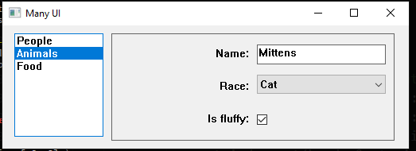
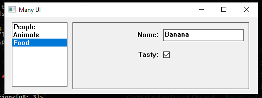

# List view
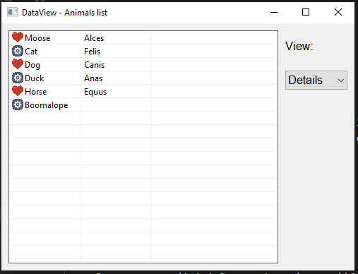

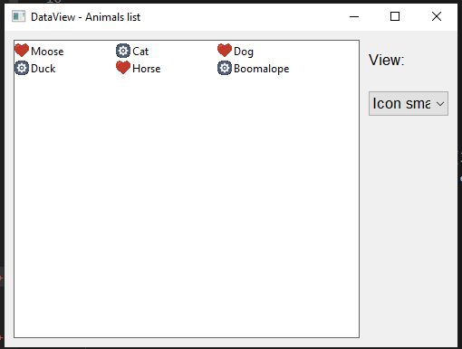

# Tray notification
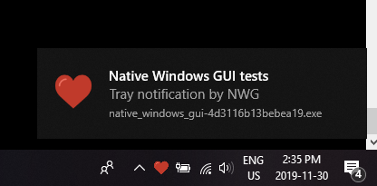

# Drawing GDI
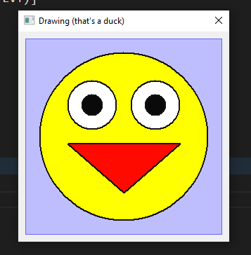

# Extern canvas OpenGL
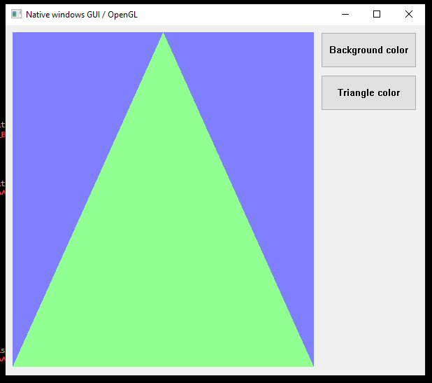

# Image decoder
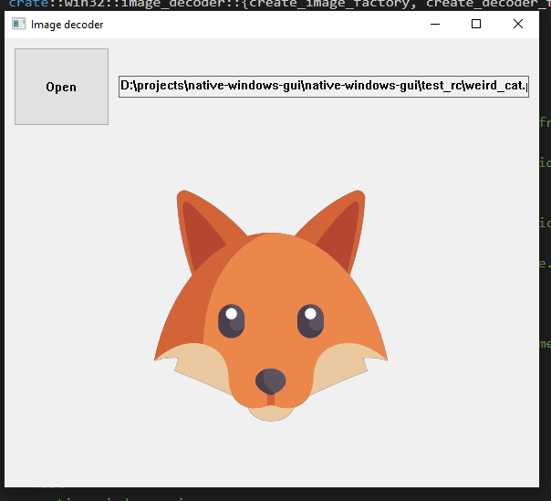

# Localization
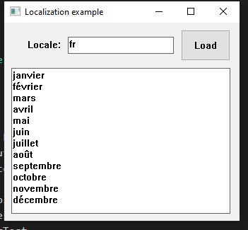

# Rich text box
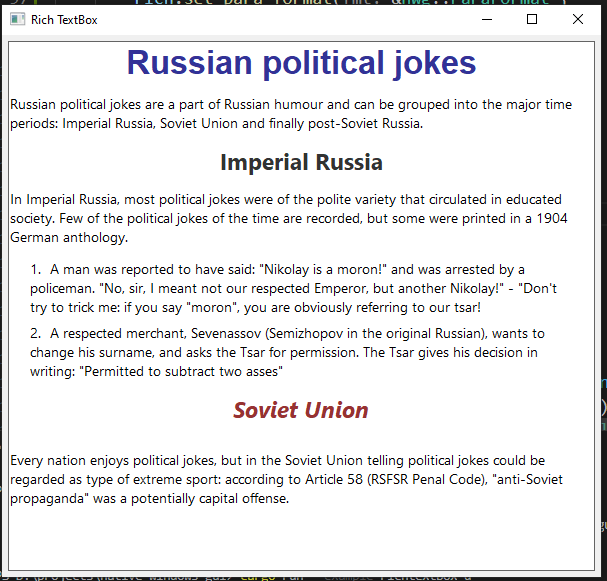

# Splash

